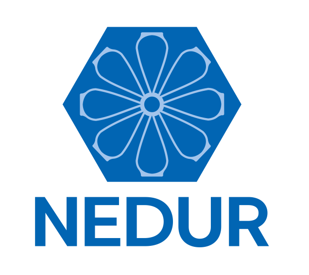

.. intro_python documentation master file, created by
   sphinx-quickstart on Mon May  9 18:12:00 2022.
   You can adapt this file completely to your liking, but it should at least
   contain the root `toctree` directive.

   
Introdução ao Python
====================

SOUZA, K. B. VALE, V. A. **Introdução ao Python**. Núcleo de Estudos em Desenvolvimento Urbano e Regional (NEDUR) da Universidade Federal do Paraná (UFPR), Curitiba-PR, 2022. Disponível em: [http://www.nedur.ufpr.br/portal/cursos](http://www.nedur.ufpr.br/portal/cursos/)

.. toctree::
   :maxdepth: 2
   :caption: Conteúdo:

   01Intro
   02Opera
   03Vartipos
   04Listas
   05Vetores
   06Matrizes
   07DataFrame
   08Graf
   09Mapas

